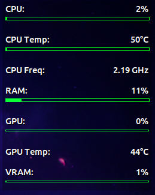

# 🖥️ Conky HUD

A minimal, modern **GNOME-compatible Conky system HUD** with a universal installer.

This project provides a lightweight on-screen system monitor showing:

* CPU usage & temperature
* CPU frequency
* RAM usage
* GPU usage, VRAM, and GPU temperature (NVIDIA)

Designed to be:

* ✅ **Universal** — no hardcoded paths
* ✅ **Portable** — install from anywhere
* ✅ **Declarative** — installer generates user config
* ✅ **Clean** — includes safe uninstall support

---

## 📸 Preview



---

## ✨ Features

* Interactive installer (choose HUD position)
* Optional **Alt + R** toggle shortcut (GNOME)
* Automatic GPU detection using `nvidia-smi`
* Color-coded performance bars
* Transparent dock-style overlay
* Safe removal via uninstall script

---

## 📦 Requirements

Tested on:

* Ubuntu 24.04 GNOME

Dependencies (installed automatically):

* `conky-all`
* `lm-sensors`
* `curl`

---

## 🚀 Installation

Clone the repository:

```bash
git clone https://github.com/JcNavjot/conky-hud.git
cd conky-hud
```

Run the installer:

```bash
./install_hud.sh
```

During installation you can:

* Choose HUD screen position
* Enable keyboard shortcut (Alt + R)

Start HUD manually anytime:

```bash
conky
```

---

## ⌨️ Toggle Shortcut

If enabled during install:

```
Alt + R
```

You can change the shortcut later via:

```
Settings → Keyboard → Custom Shortcuts
```

---

## 🧹 Uninstall

To remove the HUD safely:

```bash
./uninstall_hud.sh
```

This will:

* Stop running Conky
* Remove installed HUD config
* Remove the keyboard shortcut

System packages are **not** removed.

---

## 🧠 How It Works

The installer:

* Copies `.conkyrc` into your home directory
* Installs GPU helper script to:

```
~/.conky_gpu.py
```

This keeps the project portable — the repo can live anywhere.

---

## ⚠️ Notes

* GPU stats require NVIDIA drivers and `nvidia-smi`.
* Wayland support depends on GNOME compositor behavior.
* Designed for GNOME desktop environments.

---

## 🛠️ Project Structure

```
conky-hud/
├── install_hud.sh
├── uninstall_hud.sh
├── .conkyrc_nvtop
└── .conky_gpu.py
```

---

## 🤝 Contributing

Suggestions and improvements are welcome!

If you find issues or want new features, open a discussion or pull request.

---

## 📜 License

MIT License — feel free to use and modify.
